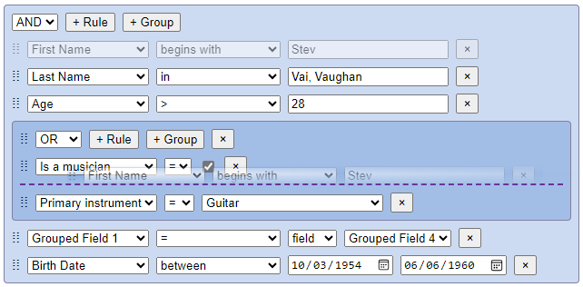

## @react-querybuilder/dnd

Augments [react-querybuilder](https://npmjs.com/package/react-querybuilder) with drag-and-drop functionality.

To see this in action, check out the [`react-querybuilder` demo](https://react-querybuilder.js.org/demo#enableDragAndDrop=true) with the drag-and-drop option enabled.

**[Full documentation](https://react-querybuilder.js.org/)**



## Installation

```bash
npm i react-querybuilder @react-querybuilder/dnd react-dnd react-dnd-html5-backend
# OR yarn add / pnpm add / bun add
```

## Usage

To enable the drag-and-drop functionality of a query builder, nest the `QueryBuilder` element under `QueryBuilderDnD`. Pass in all exports from `react-dnd` and `react-dnd-html5-backend` to the `dnd` prop of `QueryBuilderDnD`.

```tsx
import { QueryBuilderDnD } from '@react-querybuilder/dnd';
import { useState } from 'react';
import * as ReactDnD from 'react-dnd';
import * as ReactDndHtml5Backend from 'react-dnd-html5-backend';
import { QueryBuilder, RuleGroupType } from 'react-querybuilder';

const fields = [
  { name: 'firstName', label: 'First Name' },
  { name: 'lastName', label: 'Last Name' },
];

const App = () => {
  const [query, setQuery] = useState<RuleGroupType>({ combinator: 'and', rules: [] });

  return (
    <QueryBuilderDnD dnd={{ ...ReactDnD, ...ReactDndHtml5Backend }}>
      <QueryBuilder fields={fields} defaultQuery={query} onQueryChange={setQuery} />
    </QueryBuilderDnD>
  );
};
```

## Notes

- While not strictly necessary, we strongly recommend passing the `react-dnd` and `react-dnd-html5-backend` exports into `QueryBuilderDnD`. If they are not passed in as the `dnd` prop, the query builder will initially have drag-and-drop disabled until the dependencies are asynchronously loaded via `import()`.
- `QueryBuilderDnD` will automatically set the `enableDragAndDrop` prop to `true` on any descendant `QueryBuilder` elements unless `enableDragAndDrop` is explicitly set to `false` on `QueryBuilder`.
- `QueryBuilderDnD` does not need to be an _immediate_ ancestor to `QueryBuilder`, it only needs to be somewhere above `QueryBuilder` in the component hierarchy.
- Multiple `QueryBuilder`s may be nested beneath a single `QueryBuilderDnD`. The same drag-and-drop settings will be applied to each query builder, and drag-and-drop will work across query builders (rules/groups can be dragged from one query builder and dropped into another).
- If your application already uses `react-dnd` outside the scope of a query builder, use `QueryBuilderDndWithoutProvider` instead of `QueryBuilderDnD` to inherit context from your existing `DndProvider`. Example:

  ```tsx
  import { QueryBuilderDndWithoutProvider } from '@react-querybuilder/dnd';
  import { useState } from 'react';
  import * as ReactDnD from 'react-dnd';
  import * as ReactDndHtml5Backend from 'react-dnd-html5-backend';
  import { type Field, QueryBuilder, type RuleGroupType } from 'react-querybuilder';
  import { SomeOtherDndContextConsumer } from './SomeOtherDndContextConsumer';

  const fields: Field[] = [
    { name: 'firstName', label: 'First Name' },
    { name: 'lastName', label: 'Last Name' },
  ];

  function ChildComponentOfDndProvider() {
    const [query, setQuery] = useState<RuleGroupType>({ combinator: 'and', rules: [] });

    return (
      <QueryBuilderDndWithoutProvider dnd={{ ...ReactDnD, ...ReactDndHtml5Backend }}>
        <QueryBuilder fields={fields} defaultQuery={query} onQueryChange={setQuery} />
      </QueryBuilderDndWithoutProvider>
    );
  }

  export function App() {
    return (
      <ReactDnD.DndProvider backend={ReactDndHtml5Backend.HTML5Backend}>
        <SomeOtherDndContextConsumer />
        <ChildComponentOfDndProvider />
      </ReactDnD.DndProvider>
    );
  }
  ```
