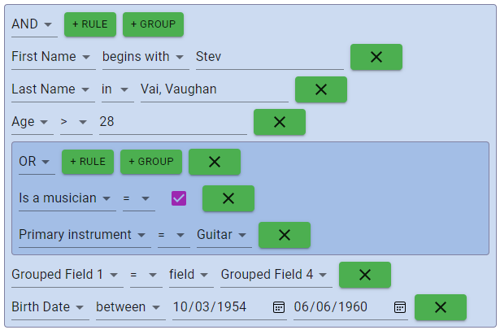

## @react-querybuilder/material

Official [react-querybuilder](https://npmjs.com/package/react-querybuilder) compatibility package for [MUI](https://mui.com/)/[Material Design](https://material.io/design).

- [Demo](https://react-querybuilder.js.org/demo/material)
- [Full documentation](https://react-querybuilder.js.org/)
- [CodeSandbox](https://react-querybuilder.js.org/sandbox?t=material) / [StackBlitz](https://react-querybuilder.js.org/sandbox?p=stackblitz&t=material) example projects



## Installation

```bash
npm i react-querybuilder @react-querybuilder/material @mui/icons-material @mui/material
# OR yarn add / pnpm add / bun add
```

## Usage

To configure the query builder to use Material-compatible components, place `QueryBuilderMaterial` above `QueryBuilder` and beneath `MaterialProvider` in the component hierarchy.

```tsx
import { createTheme, ThemeProvider } from '@mui/material/styles';
import { QueryBuilderMaterial } from '@react-querybuilder/material';
import { useState } from 'react';
import { type Field, QueryBuilder, type RuleGroupType } from 'react-querybuilder';

const muiTheme = createTheme();

const fields: Field[] = [
  { name: 'firstName', label: 'First Name' },
  { name: 'lastName', label: 'Last Name' },
];

export function App() {
  const [query, setQuery] = useState<RuleGroupType>({ combinator: 'and', rules: [] });

  return (
    <ThemeProvider theme={muiTheme}>
      <QueryBuilderMaterial>
        <QueryBuilder fields={fields} defaultQuery={query} onQueryChange={setQuery} />
      </QueryBuilderMaterial>
    </ThemeProvider>
  );
}
```

`QueryBuilderMaterial` is a React context provider that assigns the following props to all descendant `QueryBuilder` elements. The props can be overridden on the `QueryBuilder` or used directly without the context provider.

| Export                    | `QueryBuilder` prop             |
| ------------------------- | ------------------------------- |
| `materialControlElements` | `controlElements`               |
| `materialTranslations`    | `translations`                  |
| `MaterialActionElement`   | `controlElements.actionElement` |
| `MaterialDragHandle`      | `controlElements.dragHandle`    |
| `MaterialNotToggle`       | `controlElements.notToggle`     |
| `MaterialShiftActions`    | `controlElements.shiftActions`  |
| `MaterialValueEditor`     | `controlElements.valueEditor`   |
| `MaterialValueSelector`   | `controlElements.valueSelector` |

> [!TIP]
>
> By default, this package uses icons from `@mui/icons-material` for button labels. To reset button labels to their default strings, use `defaultTranslations` from `react-querybuilder`.
>
> ```tsx
> <QueryBuilderMaterial translations={defaultTranslations}>
> ```

> [!IMPORTANT]
>
> In environments based on React Server Components, [preload the MUI components](https://react-querybuilder.js.org/docs/compat#preload-mui-components).
